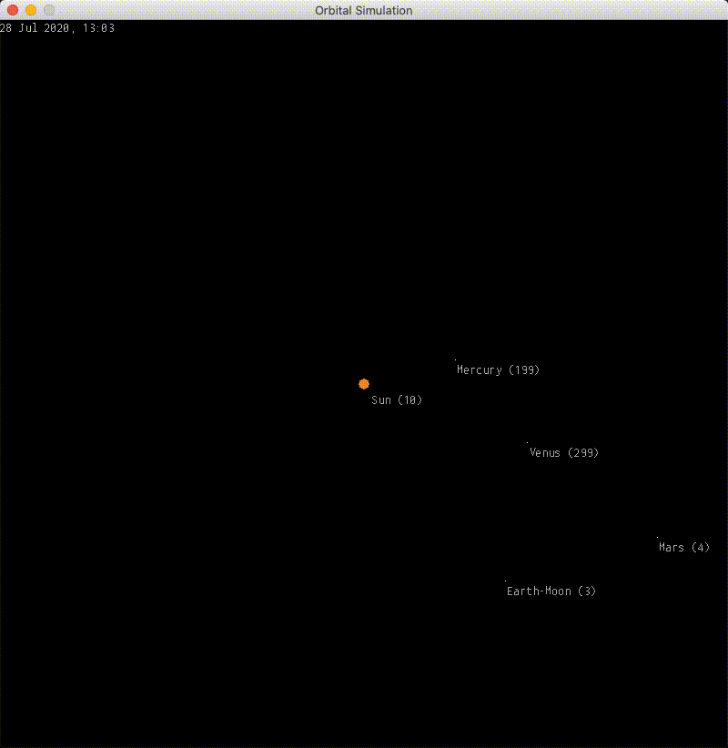

# orbital-sim

  

A customisable and interactive Python simulation build over PyGame that models **the orbits of celestial bodies in 2D space** using Newton’s law of universal gravitation!

You can choose from several included **preset arrangements** or create your own **simulation configuration from scratch!**

Precise positioning and movement vectors are obtained through built-in access to JPL’s HORIZONS system, a resource that provides precise data for objects in our solar system.



## Installing
### Dependencies
orbital-sim requires the following:
* Python 3
* Pygame 
* Astropy
* Astroquery

### User installation
orbital-sim is available as a package on PyPI and so can be easily installed for Python 3 using `pip`:
```
$ pip install orbital-sim
```

## Usage
Once you have the package installed, you’re good to go! From here, you can either try out one of the preset configurations that come with the module, or you can delve into creating your own orbital simulation! Details for both of these are explained below.

### Preset configurations
---
`presets.py` contains a number of orbital systems with all the celestial bodies already specified, so all that needs to be done is to import it, configure the simulation and get it running. 

The following are the available presets and the bodies that are included in them – details to using them are in the next section:

| Preset             | Description                                                                      |
|------------------------|----------------------------------------------------------------------------------|
| `InnerSolarSystem()` | The sun, Mercury, Venus, Earth and Mars                                          |
| `SolarSystem()`      | The sun, Mercury, Venus, Earth, Mars, Jupiter, Saturn, Uranus, Neptune and Pluto |
| `EarthMoon()`        | Just the Earth and its Moon                                                      |

**Importing presets**

In either your Python shell or a new Python file, import a specific preset configuration from the module:
```python
from orbitalsim.presets import PresetName
```


**Configuring the simulation**

Next, instantiate the preset simulation and pass through any parameters if you wish to do so. You can choose to leave everything to its default value by not including anything in the parentheses:
```python
# A preset with default settings
s = PresetName()
```
 Or manually set any or all of the following parameters:
* `dimensions` – a tuple `(x, y)` of the desired width and height
* `scale` – the number of pixels represented by a distance of 1 AU in the simulation
* `entity_scale` – magnification of an entity’s diameter
* `sim_rate` – the number of days that pass in the simulation for every second in real-life
* `start_date` – the date to start the simulation from, in format **yyyy-mm-dd**
* `fullscreen` – a boolean for whether the window should be fullscreen or not

*Tip:* go to **Setting up a custom simulation** section to find out more about these parameters.

For example:
```python
# A preset with all its parameters tweaked
s = PresetName(
    dimensions = (500, 700),
    scale = 250,
    entity_scale = 5,
    sim_rate = 3,
    start_date = '2020-07-12'
    fullscreen = True
)
```

**Running the simulation** 

Once the simulation has been instantiated, to create the PyGame window and start the simulation, just call its `start()` function:
```python
s.start()
```


### Controlling the simulation
---
Once the simulation starts, there are a number of ways to control and interact with it:

| Key(s)    | Action(s)                                          |
|-----------|----------------------------------------------------|
| `SPACE`   | Pause/play simulation                              |
| `↑ ↓ ← ↑` | Move window view; pan about                        |
| `+/-`     | Zoom in and out respectively                       |
| `r`       | Reset zoom and position                            |
| `./,`     | Speed up and slow down the simulation respectively |
| `l`       | Toggle labels on the entities                      |
| `q`       | Quit the simulation                                |


### Setting up a custom simulation
---
By setting up a custom simulation, you have control over exactly what entities to add and where. You can either select existing entities in our solar system through JPL HORIZONS or create entities with custom details and characteristics. 

The next few sections will detail how you may go about getting a custom simulation up and running using orbital-sim.

**I. Instantiate simulation**

First, we need to create a blank simulation that we then add stuff to. This is done by creating an instance of the `Simulation` class. Just like with the preset configurations, you can use the default parameters by not specifying them, or change certain ones to taste, up to you.

```python
import orbitalsim
s = orbitalsim.Simulation()
```

Parameters of the `Simulation` class:

| Parameter      | Default value | Description                                                                                                          |
|----------------|---------------|----------------------------------------------------------------------------------------------------------------------|
| `dimensions`   | `(800, 800)`   | A tuple of the width and height of the window in pixels                                                              |
| `scale`        | `-1`           | The number of pixels represented by a distance of 1 AU in the simulation (default of -1: automatically calculated)   |
| `entity_scale` | `10`           | Magnification of an entity’s diameter for better visibility                                                          |
| `sim_rate`     | `3`            | The number of days that pass in the simulation for every second in real-life                                         |
| `start_date`   | `None` *=today*| The date to start the simulation from in format **yyyy-mm-dd** (*note:* if left blank, defaults to the current day     |
| `fullscreen`   | `False`        | Boolean for whether the PyGame window is fullscreen or not (*note:* fullscreen mode overrides `dimensions` parameter |

*Note: PyGame will often encounter framerate issues on certain devices like the Retina MacBooks. If you encounter this, setting* `fullscreen = True` *will help.*

**II. Adding entities using JPL HORIZONS**

JPL HORIZONS assigns a **unique ID** to every object in the solar system that it tracks. You can search up entities and find their ID on [JPL HORIZON’s web interface](https://ssd.jpl.nasa.gov/horizons.cgi?s_target=1#top) by looking up a target body by keyword. *(While it is possible to refer to objects by name, this can sometimes be ambiguous due to multiple object names containing the same word)*

To add an entity that exists in the JPL HORIZONS system to the simulation, we’ll use the `add_horizons_entity` function of the `Simulation` object we just created. The function takes in two IDs: `entity_id` is the **entity to add**, `observer_id` is the **reference point** from where the position of `entity_id` will be calculated relative to.

**Important:** when generating the simulation, *all entity positions are calculated from the centre of the screen (0, 0)*. Therefore, ***it is recommended that entities are added in relation to the same observer*** to ensure the distances aren’t off.

For example, the following snippet adds the entity with an ID of 3 (which happens to be Earth), with its distance calculated in relation to the sun (approximately 1 AU by definition).

```python
s.add_horizons_entity(
    entity_id = '3',
    observer_id = 'sun',
    mass = 6e24,
    diameter = 8.5e-5
)
```

Parameters to the `add_horizons_entity` function:

| Parameter     | Default value | Description                                                                                                   |
|---------------|---------------|---------------------------------------------------------------------------------------------------------------|
| `entity_id`   | *required*    | JPL HORIZONS ID of the entity to add                                                                          |
| `observer_id` | *required*    | JPL HORIZONS ID of the reference point from where the position and velocity of `entity_id` is calculated from (if `entity_id` and `observer_id` are the same, the object will be rendered at the centre of the screen 0,0) |
| `mass`        | *required*    | Mass **in kg** of the entity to add (mass is not provided by JPL HORIZONS, so it has to be added manually)    |
| `diameter`    | `1e-5`          | Diameter **in AU** of the entity to add (optional – only used for correct rendering of size)                  |

**III. Adding custom entities**

You can also add a fully custom entity with the function `add_custom_entity`. With this function, you give the entity its position, movement vectors and physical characteristics. 

```python
s.add_custom_entity(
    position = (1, -0.5),
    mass = 2e24,
    speed = 0.2,
    angle = 3/2 * math.pi,
    name = 'some planet'
)
```

Some parameters are optional but some are required. See the table below for more information. 

| Parameter  | Default value | Description                                                                         |
|------------|---------------|-------------------------------------------------------------------------------------|
| `position` | *required*    | Tuple (x, y) describing the distance in **AU** from the centre of the system (0, 0) |
| `mass`     | *required*    | Mass of the entity in **kg**                                                        |
| `speed`    | `0`           | Magnitude of initial velocity in **AU/day**                                         |
| `angle`    | `0`           | Angle of initial velocity in **radians**                                            |
| `diameter` | `1e-5`        | Diameter of the entity in **AU**                                                    |
| `e`        | `0`           | (if applicable) Eccentricity of the orbit from **0-1**                              |
| `a`        | `None`        | (if applicable) Semi-major axis of the orbit in **AU**                              |
| `name`     | `''`          | A string for the entity's label name                                                |

**IV. Running the simulation**

Once everything has been setup, call the `start` function of the simulation object to begin the simulation.

```python
s.start()
```
That's it! That's all there is to getting a custom simulation up and running!


